class: justify, inverse

# Les données ordonnées

.left-column[]

```{r setup, include=FALSE}
options(htmltools.dir.version = FALSE)
library(dplyr)
library(tidyr)
library(ggformula)
library(kableExtra)
library(stringr)
```

**Hadley Wickham** est *Chief Scientist* à **RStudio** et professeur adjoint de statistiques à l’Université d’*Auckland*. Tout au long de sa carrière, il s'est heurté à des datasets désordonnés. Ainsi, en 2014, il publie « Tidy Data », article de référence qui établit clairement ce qu’est un jeu de données « propre ».

un jeu de données est propre quand :
.right-column[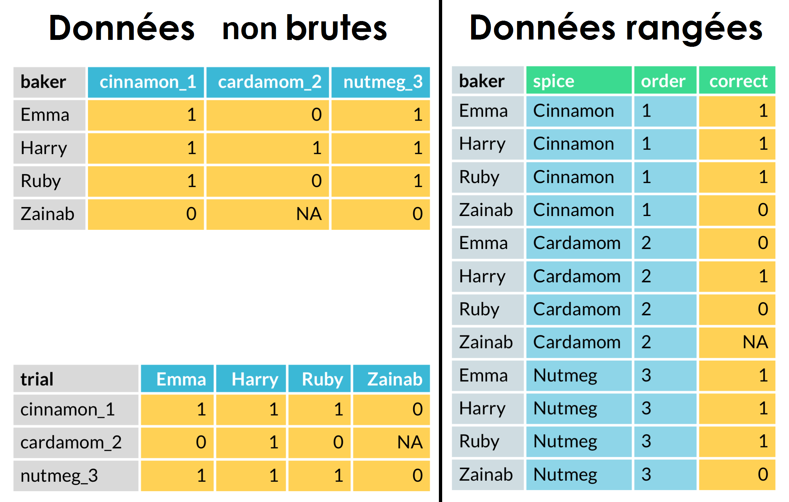]
* **chaque variable se trouve dans une colonne**
* **chaque observation compose une ligne**
* **les éléments sont contenus dans le même dataset**


---
class: inverse, center, middle

# Par exemple

---
class: left
# Un tableau sur Insee.fr

```{r exple1, echo = FALSE}
tx_chom_75 <- readxl::read_xls(path = "data/tx_chom_75.xls")
knitr::kable(
  tx_chom_75, 
  format = "html", 
  caption = "Taux de chomage localisé des départements de Nouvelle-Aquitaine (en %)"
  ) %>% 
  kableExtra::kable_styling(font_size = 16, bootstrap_options = c("striped", "hover"))
```

.footnote[
  [1] Source: Insee, chômage au sens du BIT
  
  [2] Les données du dernier trimestre sont provisoires
  ]


---
class: left
# Traiter les données des tableaux

Comment calculer les évolutions trimestrielles et/ou annuelles pour un tableau, un graphique, une carte ...

```{r exple1b, eval=FALSE}
tx_chom_75 %>% 
  mutate(
    'Evolution trimestrielle' = round(100 * (T3_2019/T2_2019 - 1) , 1)
    )
```

```{r exple1c, echo = FALSE}
tx_chom_75 %>% 
  mutate(
    'Evolution trimestrielle' = round(100 * (T3_2019/T2_2019 - 1) , 1)
    ) %>% 
  knitr::kable(
  format = "html", 
  caption = "Taux de chomage localisé des départements de Nouvelle-Aquitaine (en %)"
  ) %>% 
  kableExtra::kable_styling(
    font_size = 12, 
    bootstrap_options = c("striped", "hover")
    )
```

Problème: Lorsque les colonnes changeront, il faudra réecrire la formule de calcul.


---
class: inverse, center, middle
# Pré-requis
###Importer et traiter les données
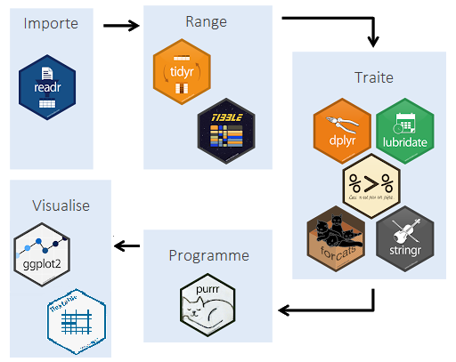


---
class: left
# Charger des données


### au format R natif
- format RDS (un seul objet)
```{r loadRDS, eval=FALSE}
readRDS("my_data.rds")
```
--
- format RData (plusieurs objets)
```{r loadRData, eval=FALSE}
load("my_data.RData")
```

--
### import de fichiers SAS
- le package **haven**
```{r importSAS, eval=FALSE}
data <- read_sas("my_data.sas7bdat")
```

--
### import de fichiers csv
- le package **readr**
```{r importcsv, eval=FALSE}
data <- read_csv2("my_data.csv")
```


---
class: left
# Charger des données(2)

### import de fichiers ods
- le package **readODS**
```{r importods, eval=FALSE}
data <- read_ods("my_data.ods")
```

--
### import de fichiers xls
- le package **readxl**
```{r importxls, eval=FALSE}
data <- read_xls("my_data.xls")
```
--
- le package **xlsx**
```{r importxlsb, eval=FALSE}
data <- read.xlsx("my_data.xlsx")
```


---
class: left
# Exporter des données vers un fichier


### au format R natif
- format RDS (un seul objet)
```{r saveRDS, eval=FALSE}
saveRDS(my_data, file = "my_data.rds")
```
--
- format RData (plusieurs objets)
```{r saveRData, eval=FALSE}
save(data1, data2, "my_data.RData")
save.image("my_data.RData") ## sauve tout l'environnement de travail
```

--
### export de fichiers SAS
- le package **haven**
```{r exportSAS, eval=FALSE}
write_sas(data, path = "my_data.sas7bdat")
```


---
class: left
# Exporter des données vers un fichier(2)

--
### export de fichiers csv
- le package **readr**
```{r exportcsv, eval=FALSE}
write_csv2(data, path = "my_data.csv")
```
--
### export de fichiers ods
- le package **readODS**
```{r exportods, eval=FALSE}
write_ods(data, "my_data.ods")
```
--
### export de fichiers xls
- le package **xlsx**
```{r exportxls, eval=FALSE}
write.xlsx2(data, file = "my_data.xlsx")
```


---
class: left
# Les variables

### Les types

- **Numérique**: *0, -1, 3.4, 6.789456*
- **Booléen**: *TRUE, FALSE* ou *T,F*
- **Caractère**: *"anticonstitutionnellment"*
- **Date**: *2008-12-25*

```{r}
class(pi)
```

--
### L'opérateur d'assignation <- ( raccourci: *Alt + 6* )
```{r}
a <- pi
b <- "vaut environ 3,14"
c <- Sys.Date()
a 
b
c
```


---
class: left
# Les variables numériques

### Les opérations arithmétiques 
** +  , -  , \*  ,  /  , ^  , %% ,  %/% **
### Les fonctions mathématiques
** sin ,  cos  , tan  , log ,  sqrt** etc ...
### Les fonctions statistiques
** mean , median  , quantile  , sum  , min  , max ** etc ...

### Les opérateurs logiques
- ** < , <= , > , => , == , != **
- ** | ** (OU) 
- ** & ** (ET)
- ** isTRUE() , is.numeric() , is.logical() , is.character() , is.Date() , is.null() , is.na() **

---
class: left
# Les chaines de caractères

### La concaténation 
** paste() ** et ** paste0() **
```{r paste}
a <- "Insee"
b <- "Mesurer pour comprendre "
paste(a, "-", b)
paste0(a, "2025")
```

### Le package *stringr*

.right-column[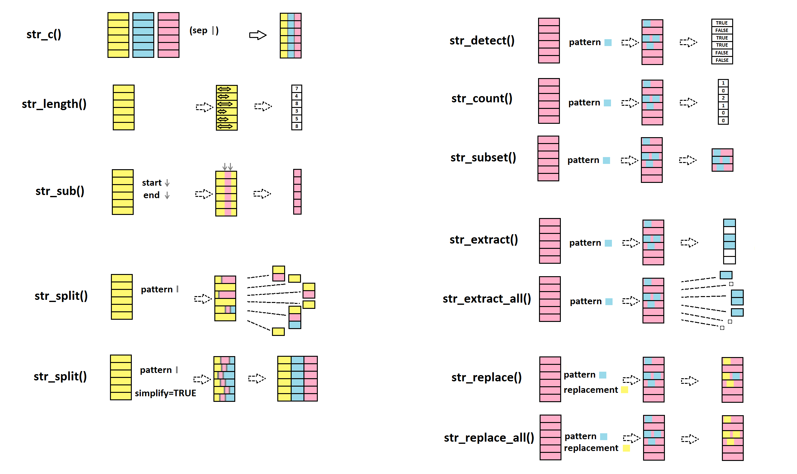]
```{r stringr}
str_trim(b)
str_sub(a,1,3)
str_replace_all(b , "e", "_")
str_split(b , " ")
```


.footnote[(http://perso.ens-lyon.fr/lise.vaudor/Descriptoire/_book/manipuler-des-strings-package-stringr.html)]


---
class: left
# Les vecteurs

### La fonction collecteur: *c()*
```{r collecteur}
vec_num <- c(122,154,132,141,147,112)
vec_num*1.5

vec_ch <- c("Pierre", "Paul", "Jean", "Jacques", "Magali")
vec_ch2 <- c(vec_ch, "Nathalie")

mean(vec_num) # taille moyenne des élements du vec_num
vec_num2 <- c(vec_num, "John")
class(vec_num)

paste(vec_ch2,"mesure",vec_num,"cm")[1:3]
```


---
class: left
# Les dataframes

### Créer un dataframe: la fonction *data.frame()*
```{r dataframe}
df <- data.frame(
  nom = c("Lambert", "Doussain", "Niang", "Gérard", "Laporte", "Herrand"),
  ville = c("Bordeaux", "Marseille", "Paris", "Bordeaux", "Paris", "Paris"),
  conjoint1 = c(1200, 1180, 1750, 2100, 1350, 1100),
  conjoint2 = c(1450, 1870, 1690, NA, 2350, NA),
  nb_personnes = c(4, 2, 3, 2, 5, 1),
  stringsAsFactors = F # pour ne pas avoir de facteurs 
)
df
```
---
class: left
# Les dataframes(2)

### Extraire des lignes, extraire des colonnes
```{r xtractdf}
df[1,2] # ligne 1, colonne 2
df[3,] # ligne 3 , toutes les colonnes
df[,1] # toutes les lignes, 1ère colonne
df$nom #identique au précédent
```

### Le pipe **%>%** (raccourci: Ctrl + Alt + M)
Enchaine les opérations de la gauche vers la droite
```{r pipe}
df$conjoint1 %>% mean
```
### Les modalités d'une variable: la fonction *unique*

```{r}
df$ville %>% unique
```

---
class: left
# Traiter les données avec *dplyr*

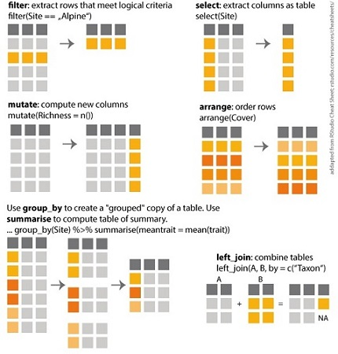

.footnote[(https://audhalbritter.com/my-top-8-dplyr-functions/)]

Les verbes de dplyr: **summarize**, **slice**, **rename**, **select**, **arrange**, **mutate**, **group_by**


---
class: left
# *dplyr* : statistiques avec **summarise**

```{r summarise}
df %>% summarise(
  'Nombre de ménages' = n(),
  'Revenu moyen du 1er conjoint' = mean(conjoint1)
  )
```


---
class: left
# *dplyr* : découper les données avec **slice** et **sample_n**

```{r slice}
df %>% slice(1:3) # découpe les enregistrements de 1 à 3
df %>% sample_n(2) # découpe 2 enregistrements au hasard
df %>% sample_frac(0.25) # découpe 25% des données
```


---
class: left
# *dplyr* : renommer des variables **rename**

- **rename** renomme des variables
```{r rename}
df %>% rename(origine = ville) # renomme la variable ville en origine
```


---
class: left
# *dplyr* : selectionner des variables **select**

- **select** selectionne et/ou réorganise et/ou renomme les variables
```{r select}
df %>% select(c(3,5)) # les 3ème et 5ème variables
df %>% select(origine = ville) # la variable ville sera renommée
```


---
class: left
# *dplyr* : selectionner des variables **select** (2)

- **select** selectionne et/ou réorganise et/ou renomme les variables
```{r select2}
df %>% select(starts_with("conjoint")) # commencent par "conjoint"
df %>% select(origine = ville, nom, nb_personnes, everything())
```


---
class: left
# *dplyr* : trier les données avec **arrange**

```{r arrange}
df %>% arrange(conjoint1) # tri selon conjoint1
df %>% arrange(desc(nb_personnes)) # tri décroissant
```


---
class: left
# *dplyr* : créer des colonnes avec **mutate**

```{r mutate}
df %>% mutate(revenu = conjoint1 + conjoint2) # opération
df %>% mutate(
  conjoint2 = if_else(is.na(conjoint2), 0, conjoint2),
  revenu_par_personne = (conjoint1 + conjoint2) / nb_personnes
  )
```


---
class: left
# *dplyr* : calculs en ligne avec *rowwise()*

```{r rowwise}
df %>% mutate(
  revenu_par_personne = sum(conjoint1, conjoint2, na.rm = T) / nb_personnes
  ) # calcule la somme de la colonne
df %>% rowwise() %>% mutate(
  revenu_par_personne = sum(conjoint1, conjoint2, na.rm = T) / nb_personnes
  ) # la somme ne se fait que pour la ligne courante
```


---
class: left
# *dplyr* : statistiques par modalités avec *group_by*

```{r group_by}
df %>% rowwise() %>% 
  mutate(total = sum(conjoint1, conjoint2, na.rm = T)) %>% 
  ungroup %>% # pour "oublier" le comptage par ligne
  group_by(ville) %>%  
  summarise(`Nombre de ménages` = n(),
            `Revenu moyen` = mean(total),
            `Nombre de personnes` = sum(nb_personnes),
            `Taille moyenne` = `Nombre de personnes`/`Nombre de ménages`
            )
```


---
class: left
# *dplyr* : Selection de lignes

.left-column[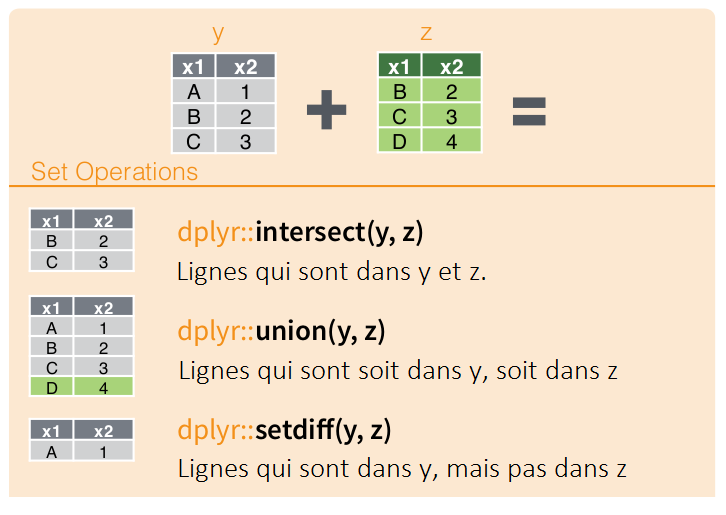]
```{r set_op}
a <- df %>% select(nom,ville)
b <- data.frame(
  nom = c("Gérard", "N'Guyen", "Lambert", 
          "Dupont", "Niang"),
  ville = c("Bordeaux", "Marseille", "Paris", 
            "Bordeaux", "Paris"),
  stringsAsFactors = F
)
```

.right-column[
### union()
```{r union}
union(a,b)
```
]

### intersect()
```{r intersect}
intersect(a,b)
```

### setdiff()
```{r setdiff}
setdiff(a,b)
```


---
class: left
# *dplyr* : Concaténation

.left-column[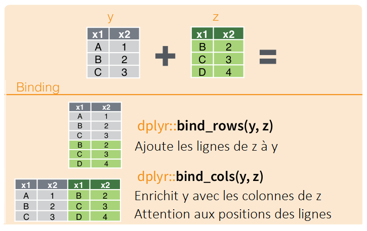]
```{r concat}
c <- data.frame(
  age = c(25, 45, 51, 18, 33, 40)
  )
```

</br></br>


.right-column[
### bind_cols()
```{r}
bind_cols(a,c)
```
]

### bind_rows()

```{r}
bind_rows(a,b)
```

---
class: left
# *dplyr* : Jointures
.right-column[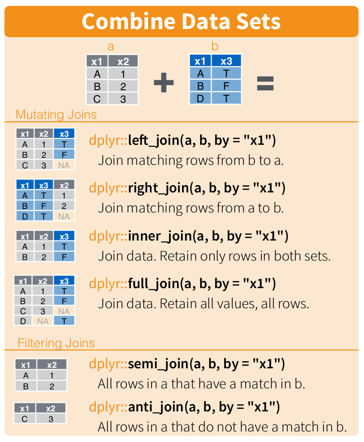]

### left_join()
Enrichit la table de gauche avec de nouvelles colonnes
### right_join()
Enrichit la table de droite avec de nouvelles colonnes
### inner_join()
Joint toutes les colonnes des lignes communes aux deux tables
### full_join()
Joint toutes les colonnes
### semi_join()
Les lignes de la table de gauche présentes dans celle de droite
### anti_join()
Les lignes de la table de gauche qui ne sont pas présentes dans celle de droite


---
class: inverse, center, middle
# Ranger un jeu de données 

### [taɪdi]


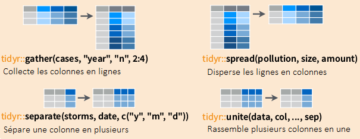

---
class: left
# Rendre les données exploitables
.left-column[]
Les extensions du **tidyverse** comme *dplyr* ou *ggplot2* utilisent des données “rangées”, appelées *tidy data*.
Prenons un exemple avec les données suivantes, qui indique la population de trois pays pour quatre années différentes : 
### Les données non brutes
```{r data, echo= F}
pop_mess <- readRDS(file = "pop_mess.rds")
kable(pop_mess) %>% kable_styling(font_size = "12")
```
Les années sont en colonne, ce qui signifie que chaque année est un "indicateur" (une variable). Or, pour représenter une variable, il faut qu'elle soit relative à des "modalités", chaque pays représentant une "série" (une courbe différente). 

---
class: left
# Utilisation des deux types de tableaux
.right-column[]
Les deux exemples de données brutes ci-contre démontrent l'utilité d'avoir un jeu "rangé". 
Ce qui ne convient pas:
- les colonnes du premier jeu comprennent deux informations: l'épice utilisé et l'ordre d'utilisation
- les deux tableaux correspondent aux mêmes données et sont transposables
- il sera plus difficile de faire des comptages, des modélisations ou des représentations graphiques avec un tableau de contingence qu'avec un tableau de données ordonnées et rangées.

---
class: left
# Rassembler les colonnes: *gather*

### Syntaxe
.right-column[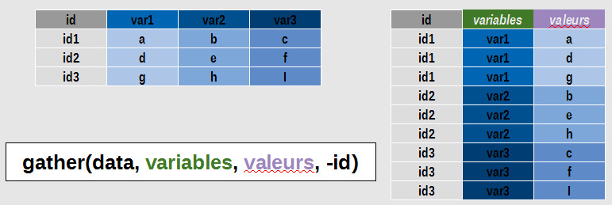]Le verbe **gather** va transformer les colonnes qui contiennent ces valeurs en lignes selon le schéma vu à la diapo précédente. 

La syntaxe est la suivante:

</br>

```{r syntaxe_gather, eval = FALSE}
gather(data, key = variable, value = valeur, -id)
```

ou avec le pipe %>%:

```{r syntaxe_gatherpipe, eval = FALSE}
data %>% gather(key = variable, value = valeur, -id)
```

- *data* est le jeu de données à ordonner
- *variables* sera le nom de la colonne qui rassemblera les variables
- *valeurs* sera le nom de la colonne qui rassemblera les valeurs

> Attention: Le verbe *gather* est remplacé par *pivot_longer*. La syntaxe est `pivot_longer(data, liste_de_colonnes, names_to , values_to)`
---
class: left
# Exemple d'utilisation de *gather*

Le tableau suivant contient les valeurs des populations et des espérances de vie pour 2002 et 2007. En voici les 10 premières lignes: 

```{r gapmind_messy, echo=F}
gapmind_messy <- readRDS(file = "gapmind_mess.rds") %>% mutate_if(is.factor, as.character)
gapmind_messy %>% head(10) %>% kable(format = "html") %>% kable_styling(font_size = "12")
```

Nous allons rassembler les colonnes pop_2002, pop_2007, lifeExp_2002, lifeExp_2007:

```{r gapmind_tidy_1, eval = F}
gather(gapmind_messy, key = variables, value = valeur, -c(country, continent))

```
```{r gapmind_tidy_2, echo=F}
gapmind <- gapmind_messy %>% gather(key = variables, value = valeur, -c(country, continent))
gapmind %>% sample_n(6)
```


---
class: left
# Conséquence d'un *gather* sur les dimensions du jeu de données
### Le jeu de données avant *gather*
```{r struct_gather, echo = F}
str(gapmind_messy)
```
### Le jeu de données après *gather*
```{r struct_gather2, echo = F}
str(gapmind)
```

On remarque que le nombre de lignes est passé de `r nrow(gapmind_messy)` à `r nrow(gapmind)`. En effet, 4 colonnes ont été rassemblées, soit une multiplication par quatre du nombre de lignes.

---
class: left
# Séparer une colonne: *separate*
### Syntaxe
.right-column[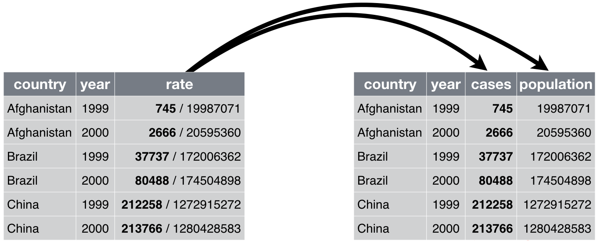]Le verbe **separate** va retrouver les informations multiples contenues dans une colonne et les répartir dans des colonnes différentes. 

La syntaxe est la suivante:

</br></br>

```{r syntaxe_separate, eval = FALSE}
separate(data, col = colonne, into = c("col1", "col2"), se = "chaine")
```


- *data* est le jeu de données 
- *colonne* est le nom de la colonne qui contient les informations
- *into* est le nom des colonnes qui contiendront les informations separées
- *separate* est la chaine de caractère qui sépare les informations dans *colonne*


---
class: left
# Exemple d'utilisation de *separate*

### Exemple
Dans le tableau précédent, la colonne *variables* contient deux informations: la variable et l'année. On va séparer cette colonne en deux, une colonne *variable* et une colonne *annee*.

```{r gapmind_tidy_3, eval = F}
separate(gapmind, col = variables, into = c("variable", "annee"), sep = "_")

```
```{r gapmind_tidy_4, echo=F}
gapmind2 <- gapmind %>% separate(col = variables, into = c("variable", "annee"), sep = "_")
gapmind2 %>% sample_n(8) %>% kable()%>%
  kable_styling(bootstrap_options = c("striped", "hover", "condensed"), font_size = 10)
```

---
class: left
# Le verbe **extract**
**extract** permet de créer de nouvelles colonnes à partir de sous-chaînes d’une colonne de texte existante, identifiées par des groupes dans une expression régulière.

```{r}
df <- data.frame(
  eleve = c("Félicien Machin", "Raymonde Bidule", "Martial Truc"),
  note = c("5/20", "6/10", "87/100"),
  stringsAsFactors = FALSE)

df %>% extract(eleve,
               c("initiale_prenom", "initiale_nom"),
               "^(.).* (.).*$",
               remove = FALSE)
```


---
class: left
# Regrouper plusieurs colonnes: *unite*
### Syntaxe
```{r unite_syntaxe, eval=F}
unite(data, col_a_creer, col_a_regrouper, separateur)
```

### Exemple
Soit le tableau suivant:
```{r unite_1, echo=F}
listecom  <-  readRDS("data/listecom.Rds")
listecom %>% head(6)
```
Regroupons les colonnes *dep* et *codcom* en une seule colonne, *codgeo*:
```{r unite_2}
listecom %>% unite(codgeo, dep, codcom, sep="") %>% head(6)
```

---
class: left
# Completer un jeu de données: *complete*
### Syntaxe
```{r complete_syntaxe, eval=F}
complete(data, col_a_combiner, fill = liste_valeurs)
```

### Exemple
Quatre personnes ont visité des villes d'Italie et leur ont attribué une note.

```{r, echo = F}
data <- data.frame(
  Nom = c("Pierre", "Vanessa", "Louis", "Anaïs", "Pierre", "Louis", "Anaïs", "Pierre", "Vanessa", "Louis"),
  Ville = c(rep("Venise",4), rep("Rome", 3), rep("Naples",3) ),
  Pays = rep("Italie", 10),
  Note = c(4,3,1,5,4,1,2,3,2,5),
  stringsAsFactors = F
)

data %>% kable()%>%
  kable_styling(bootstrap_options = c("striped", "hover", "condensed"), font_size = 8)
```

Il manque deux combinaisons Nom, Ville. Le verbe **complete** va créer les enregistrements avec les valeurs *Italie* et *NA* pour les champs Pays et Note.

```{r , eval=F}
complete(data, Nom, Ville, fill = list(Pays = "Italie", Note = NA))
```

```{r tab_complete, echo=F}
data_comp <- data %>% complete(Nom, Ville, fill = list(Pays = "Italie", Note = NA)) %>% kable() %>%
  kable_styling(bootstrap_options = c("striped", "hover", "condensed"), font_size = 8)
data_comp
```


---
class: left
# Réaliser un tableau: *spread*
.right-column[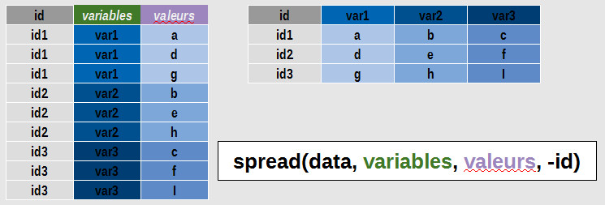]
Le verbe **spread** fait le contraire de **gather** à savoir répartir les modalités d'une variable et leurs valeurs comme nouvelles colonnes du tableau.
### Syntaxe
```{r spread_syntaxe, eval=F}
spread(data, key = variables , value = valeurs, fill = liste_valeurs)
```

### Exemple
Reprenons notre exemple avant l'application du verbe **unite**.
```{r spread}
data %>% spread(key = Ville, value = Note, fill = "nc")
```


---
class: left
# Exemple récapitulatif 1/
.right-column[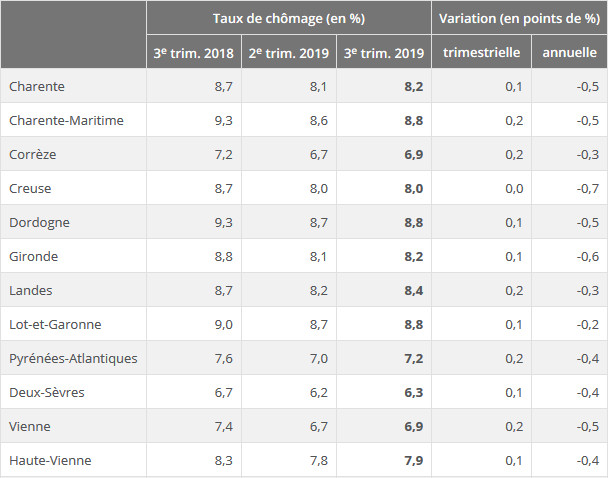]On télecharge le fichier de la série des taux de chômage par département sur Insee.fr<sup>1</sup>.

On souhaite réaliser le tableau ci-contre, présent sur le tableau de bord de la conjoncture de Nouvelle-Aquitaine<sup>2</sup>.
.footnote[
[1] https://www.insee.fr/fr/statistiques/series/102760732

[2] https://www.insee.fr/fr/statistiques/2121832#alpc_0104
]

Les données, sont dans un tableau dont les deux premières colonnes sont le code et le libellé du département et les suivantes correspondent chacune à un trimestre.
```{r load_txchom}
tx_chom <- readxl::read_xls("data/tx_chom.xls")
tx_chom[1:4,1:10]
```


---
class:left
# Exemple récapitulatif 2/

On récupère le trimestre le plus récent, et on construit la liste des trimestres qui devront apparaitre dans notre tableau final.
```{r trim}
trim <- as.numeric(str_sub(last(names(tx_chom)),2,2))
ann <- as.numeric(str_sub(last(names(tx_chom)),4,7))

trimestres <- c(
  paste0("T", trim, "_", ann - 1),
  paste0("T", 1 + ( trim + 2) %% 4, "_", ann),
  paste0("T", trim, "_", ann)
)

trimestres
```

On charge un table de zonages pour enrichir le tableau avec la région.

```{r, eval = F}
load("data/zonages.Rda")
tx_chom <- tx_chom %>% 
  inner_join(dc_zonages %>% distinct(dep, reg) , by = c("Code" = "dep")) %>% 
  inner_join(lreg, by = c("reg")) %>% 
  select(dep = Code, ldep = Libellé, Région = lreg, everything(), -reg)
```

```{r, echo = F}
load("data/zonages.Rda")
tx_chom <- tx_chom %>% 
  inner_join(dc_zonages %>% distinct(dep, reg) , by = c("Code" = "dep")) %>% 
  inner_join(lreg, by = c("reg")) %>% 
  select(dep = Code, ldep = Libellé, Région = lreg, everything(), -reg)
tx_chom[1:3, 1:6]
```


---
class: inverse, center, middle
# Les tableaux
###Réalisation et mise en forme 

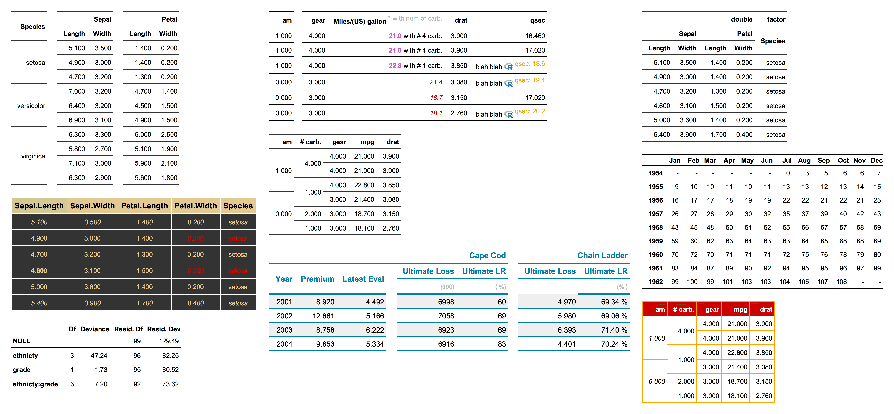


---
class: inverse, center, middle
# Les graphiques
###Création, mise en forme et export


---
# Prout

Install the **xaringan** package from [Github](https://github.com/yihui/xaringan):

```{r eval=FALSE, tidy=FALSE}
devtools::install_github("yihui/xaringan")
```

--

You are recommended to use the [RStudio IDE](https://www.rstudio.com/products/rstudio/), but you do not have to.

- Create a new R Markdown document from the menu `File -> New File -> R Markdown -> From Template -> Ninja Presentation`;<sup>1</sup>

--

- Click the `Knit` button to compile it;

--

- or use the [RStudio Addin](https://rstudio.github.io/rstudioaddins/)<sup>2</sup> "Infinite Moon Reader" to live preview the slides (every time you update and save the Rmd document, the slides will be automatically reloaded in RStudio Viewer.

.footnote[
[1] 中文用户请看[这份教程](http://slides.yihui.name/xaringan/zh-CN.html)

[2] See [#2](https://github.com/yihui/xaringan/issues/2) if you do not see the template or addin in RStudio.
]

---
background-image: url(`r xaringan:::karl`)
background-position: 50% 50%
class: center, bottom, inverse

# You only live once!

---

# Hello Ninja

As a presentation à la con ninja, you certainly should not be satisfied by the "Hello World" example. You need to understand more about two things:

1. The [remark.js](https://remarkjs.com) library;

1. The **xaringan** package;

Basically **xaringan** *injected* the chakra of R Markdown (minus Pandoc) into **remark.js**. The slides are rendered by remark.js in the web browser, and the Markdown source needed by remark.js is generated from R Markdown (**knitr**).

---

# remark.js

You can see an introduction of remark.js from [its homepage](https://remarkjs.com). You should read the [remark.js Wiki](https://github.com/gnab/remark/wiki) at least once to know how to

- create a new slide (Markdown syntax<sup>*</sup> and slide properties);

- format a slide (e.g. text alignment);

- configure the slideshow;

- and use the presentation (keyboard shortcuts).

It is important to be familiar with remark.js before you can understand the options in **xaringan**.

.footnote[[*] It is different with Pandoc's Markdown! It is limited but should be enough for presentation purposes. Come on... You do not need a slide for the Table of Contents! Well, the Markdown support in remark.js [may be improved](https://github.com/gnab/remark/issues/142) in the future.]

---
background-image: url(`r xaringan:::karl`)
background-size: cover
class: center, bottom, inverse

# I was so happy to have discovered remark.js!

---
class: inverse, middle, center

# Using xaringan

---

# xaringan

Provides an R Markdown output format `xaringan::moon_reader` as a wrapper for remark.js, and you can use it in the YAML metadata, e.g.

```yaml
---
title: "A Cool Presentation"
output:
  xaringan::moon_reader:
    yolo: true
    nature:
      autoplay: 30000
---
```

See the help page `?xaringan::moon_reader` for all possible options that you can use.

---

# remark.js vs xaringan

Some differences between using remark.js (left) and using **xaringan** (right):

.pull-left[
1. Start with a boilerplate HTML file;

1. Plain Markdown;

1. Write JavaScript to autoplay slides;

1. Manually configure MathJax;

1. Highlight code with `*`;

1. Edit Markdown source and refresh browser to see updated slides;
]

.pull-right[
1. Start with an R Markdown document;

1. R Markdown (can embed R/other code chunks);

1. Provide an option `autoplay`;

1. MathJax just works;<sup>*</sup>

1. Highlight code with `{{john}}`;

1. The RStudio addin "Infinite Moon Reader" automatically refreshes slides on changes;
]

.footnote[[*] Not really. See next page.]

---

# Math Expressions

You can write LaTeX math expressions inside a pair of dollar signs, e.g. &#36;\alpha+\beta$ renders $\alpha+\beta$. You can use the display style with double dollar signs:

```
$$\bar{X}=\frac{1}{n}\sum_{i=1}^nX_i$$
```

$$\bar{X}=\frac{1}{n}\sum_{i=1}^nX_i$$

Limitations:

1. The source code of a LaTeX math expression must be in one line, unless it is inside a pair of double dollar signs, in which case the starting `$$` must appear in the very beginning of a line, followed immediately by a non-space character, and the ending `$$` must be at the end of a line, led by a non-space character;

1. There should not be spaces after the opening `$` or before the closing `$`.

1. Math does not work on the title slide (see [#61](https://github.com/yihui/xaringan/issues/61) for a workaround).

---

# R Code

```{r comment='#'}
# a boring regression
fit = lm(dist ~ 1 + speed, data = cars)
coef(summary(fit))
dojutsu = c('地爆天星', '天照', '加具土命', '神威', '須佐能乎', '無限月読')
grep('天', dojutsu, value = TRUE)
```

---

# R Plots

```{r cars, fig.height=4, dev='svg'}
par(mar = c(4, 4, 1, .1))
plot(cars, pch = 19, col = 'darkgray', las = 1)
abline(fit, lwd = 2)
```

---

# Tables

If you want to generate a table, make sure it is in the HTML format (instead of Markdown or other formats), e.g.,

```{r}
knitr::kable(head(iris), format = 'html')
```

---

# HTML Widgets

I have not thoroughly tested HTML widgets against **xaringan**. Some may work well, and some may not. It is a little tricky.

Similarly, the Shiny mode (`runtime: shiny`) does not work. I might get these issues fixed in the future, but these are not of high priority to me. I never turn my presentation into a Shiny app. When I need to demonstrate more complicated examples, I just launch them separately. It is convenient to share slides with other people when they are plain HTML/JS applications.

See the next page for two HTML widgets.

---

```{r out.width='100%', fig.height=6, eval=require('leaflet')}
library(leaflet)
leaflet() %>% addTiles() %>% setView(-93.65, 42.0285, zoom = 17)
```

---

```{r eval=require('DT'), tidy=FALSE}
DT::datatable(
  head(iris, 10),
  fillContainer = FALSE, options = list(pageLength = 8)
)
```

---

# Some Tips

- When you use the "Infinite Moon Reader" addin in RStudio, your R session will be blocked by default. You can click the red button on the right of the console to stop serving the slides, or use the _daemonized_ mode so that it does not block your R session. To do the latter, you can set the option

    ```r
    options(servr.daemon = TRUE)
    ```
    
    in your current R session, or in `~/.Rprofile` so that it is applied to all future R sessions. I do the latter by myself.
    
    To know more about the web server, see the [**servr**](https://github.com/yihui/servr) package.

--

- Do not forget to try the `yolo` option of `xaringan::moon_reader`.

    ```yaml
    output:
      xaringan::moon_reader:
        yolo: true
    ```

---

# Some Tips

- Slides can be automatically played if you set the `autoplay` option under `nature`, e.g. go to the next slide every 30 seconds in a lightning talk:

    ```yaml
    output:
      xaringan::moon_reader:
        nature:
          autoplay: 30000
    ```

--

- A countdown timer can be added to every page of the slides using the `countdown` option under `nature`, e.g. if you want to spend one minute on every page when you give the talk, you can set:

    ```yaml
    output:
      xaringan::moon_reader:
        nature:
          countdown: 60000
    ```

    Then you will see a timer counting down from `01:00`, to `00:59`, `00:58`, ... When the time is out, the timer will continue but the time turns red.
    
---

# Some Tips

- The title slide is created automatically by **xaringan**, but it is just another remark.js slide added before your other slides.

    The title slide is set to `class: center, middle, inverse, title-slide` by default. You can change the classes applied to the title slide with the `titleSlideClass` option of `nature` (`title-slide` is always applied).

    ```yaml
    output:
      xaringan::moon_reader:
        nature:
          titleSlideClass: [top, left, inverse]
    ```
    
--

- If you'd like to create your own title slide, disable **xaringan**'s title slide with the `seal = FALSE` option of `moon_reader`.

    ```yaml
    output:
      xaringan::moon_reader:
        seal: false
    ```

---

# Some Tips

- There are several ways to build incremental slides. See [this presentation](https://slides.yihui.name/xaringan/incremental.html) for examples.

- The option `highlightLines: true` of `nature` will highlight code lines that start with `*`, or are wrapped in `{{ }}`, or have trailing comments `#<<`;

    ```yaml
    output:
      xaringan::moon_reader:
        nature:
          highlightLines: true
    ```

    See examples on the next page.

---

# Some Tips


.pull-left[
An example using a leading `*`:

    ```r
    if (TRUE) {
    ** message("Very important!")
    }
    ```
Output:
```r
if (TRUE) {
* message("Very important!")
}
```

This is invalid R code, so it is a plain fenced code block that is not executed.
]

.pull-right[
An example using `{{}}`:

````
`r ''````{r tidy=FALSE}
if (TRUE) {
*{{ message("Very important!") }}
}
```
````
Output:
```{r tidy=FALSE}
if (TRUE) {
{{ message("Very important!") }}
}
```

It is valid R code so you can run it. Note that `{{}}` can wrap an R expression of multiple lines.
]

---

# Some Tips

An example of using the trailing comment `#<<` to highlight lines:

````markdown
`r ''````{r tidy=FALSE}
library(ggplot2)
ggplot(mtcars) + 
  aes(mpg, disp) + 
  geom_point() +   #<<
  geom_smooth()    #<<
```
````

Output:

```{r tidy=FALSE, eval=FALSE}
library(ggplot2)
ggplot(mtcars) + 
  aes(mpg, disp) + 
  geom_point() +   #<<
  geom_smooth()    #<<
```

---

# Some Tips

When you enable line-highlighting, you can also use the chunk option `highlight.output` to highlight specific lines of the text output from a code chunk. For example, `highlight.output = TRUE` means highlighting all lines, and `highlight.output = c(1, 3)` means highlighting the first and third line.

````md
`r ''````{r, highlight.output=c(1, 3)}
head(iris)
```
````

```{r, highlight.output=c(1, 3), echo=FALSE}
head(iris)
```

Question: what does `highlight.output = c(TRUE, FALSE)` mean? (Hint: think about R's recycling of vectors)

---

# Some Tips

- To make slides work offline, you need to download a copy of remark.js in advance, because **xaringan** uses the online version by default (see the help page `?xaringan::moon_reader`).

- You can use `xaringan::summon_remark()` to download the latest or a specified version of remark.js. By default, it is downloaded to `libs/remark-latest.min.js`.

- Then change the `chakra` option in YAML to point to this file, e.g.

    ```yaml
    output:
      xaringan::moon_reader:
        chakra: libs/remark-latest.min.js
    ```

- If you used Google fonts in slides (the default theme uses _Yanone Kaffeesatz_, _Droid Serif_, and _Source Code Pro_), they won't work offline unless you download or install them locally. The Heroku app [google-webfonts-helper](https://google-webfonts-helper.herokuapp.com/fonts) can help you download fonts and generate the necessary CSS.

---

# Macros

- remark.js [allows users to define custom macros](https://github.com/yihui/xaringan/issues/80) (JS functions) that can be applied to Markdown text using the syntax `![:macroName arg1, arg2, ...]` or ``. For example, before remark.js initializes the slides, you can define a macro named `scale`:

    ```js
    remark.macros.scale = function (percentage) {
      var url = this;
      return '';
    };
    ```

    Then the Markdown text

    ```markdown
    
    ```

    will be translated to
    
    ```html
    
    ```

---

# Macros (continued)

- To insert macros in **xaringan** slides, you can use the option `beforeInit` under the option `nature`, e.g.,

    ```yaml
    output:
      xaringan::moon_reader:
        nature:
          beforeInit: "macros.js"
    ```

    You save your remark.js macros in the file `macros.js`.

- The `beforeInit` option can be used to insert arbitrary JS code before `remark.create()`. Inserting macros is just one of its possible applications.

---

# CSS

Among all options in `xaringan::moon_reader`, the most challenging but perhaps also the most rewarding one is `css`, because it allows you to customize the appearance of your slides using any CSS rules or hacks you know.

You can see the default CSS file [here](https://github.com/yihui/xaringan/blob/master/inst/rmarkdown/templates/xaringan/resources/default.css). You can completely replace it with your own CSS files, or define new rules to override the default. See the help page `?xaringan::moon_reader` for more information.

---

# CSS

For example, suppose you want to change the font for code from the default "Source Code Pro" to "Ubuntu Mono". You can create a CSS file named, say, `ubuntu-mono.css`:

```css
@import url(https://fonts.googleapis.com/css?family=Ubuntu+Mono:400,700,400italic);

.remark-code, .remark-inline-code { font-family: 'Ubuntu Mono'; }
```

Then set the `css` option in the YAML metadata:

```yaml
output:
  xaringan::moon_reader:
    css: ["default", "ubuntu-mono.css"]
```

Here I assume `ubuntu-mono.css` is under the same directory as your Rmd.

See [yihui/xaringan#83](https://github.com/yihui/xaringan/issues/83) for an example of using the [Fira Code](https://github.com/tonsky/FiraCode) font, which supports ligatures in program code.

---

# Themes

Don't want to learn CSS? Okay, you can use some user-contributed themes. A theme typically consists of two CSS files `foo.css` and `foo-fonts.css`, where `foo` is the theme name. Below are some existing themes:

```{r}
names(xaringan:::list_css())
```

---

# Themes

To use a theme, you can specify the `css` option as an array of CSS filenames (without the `.css` extensions), e.g.,

```yaml
output:
  xaringan::moon_reader:
    css: [default, metropolis, metropolis-fonts]
```

If you want to contribute a theme to **xaringan**, please read [this blog post](https://yihui.name/en/2017/10/xaringan-themes).

---
class: inverse, middle, center
background-image: url(https://upload.wikimedia.org/wikipedia/commons/3/39/Naruto_Shiki_Fujin.svg)
background-size: contain

# Naruto

---
background-image: url(https://upload.wikimedia.org/wikipedia/commons/b/be/Sharingan_triple.svg)
background-size: 100px
background-position: 90% 8%

# Sharingan

The R package name **xaringan** was derived<sup>1</sup> from **Sharingan**, a dōjutsu in the Japanese anime _Naruto_ with two abilities:

- the "Eye of Insight"

- the "Eye of Hypnotism"

I think a presentation is basically a way to communicate insights to the audience, and a great presentation may even "hypnotize" the audience.<sup>2,3</sup>

.footnote[
[1] In Chinese, the pronounciation of _X_ is _Sh_ /ʃ/ (as in _shrimp_). Now you should have a better idea of how to pronounce my last name _Xie_.

[2] By comparison, bad presentations only put the audience to sleep.

[3] Personally I find that setting background images for slides is a killer feature of remark.js. It is an effective way to bring visual impact into your presentations.
]

---

# Naruto terminology

The **xaringan** package borrowed a few terms from Naruto, such as

- [Sharingan](http://naruto.wikia.com/wiki/Sharingan) (写輪眼; the package name)

- The [moon reader](http://naruto.wikia.com/wiki/Moon_Reader) (月読; an attractive R Markdown output format)

- [Chakra](http://naruto.wikia.com/wiki/Chakra) (查克拉; the path to the remark.js library, which is the power to drive the presentation)

- [Nature transformation](http://naruto.wikia.com/wiki/Nature_Transformation) (性質変化; transform the chakra by setting different options)

- The [infinite moon reader](http://naruto.wikia.com/wiki/Infinite_Tsukuyomi) (無限月読; start a local web server to continuously serve your slides)

- The [summoning technique](http://naruto.wikia.com/wiki/Summoning_Technique) (download remark.js from the web)

You can click the links to know more about them if you want. The jutsu "Moon Reader" may seem a little evil, but that does not mean your slides are evil.

---

class: center

# Hand seals (印)

Press `h` or `?` to see the possible ninjutsu you can use in remark.js.


---

class: center, middle

# Thanks!

Slides created via the R package [**xaringan**](https://github.com/yihui/xaringan).

The chakra comes from [remark.js](https://remarkjs.com), [**knitr**](http://yihui.name/knitr), and [R Markdown](https://rmarkdown.rstudio.com).
